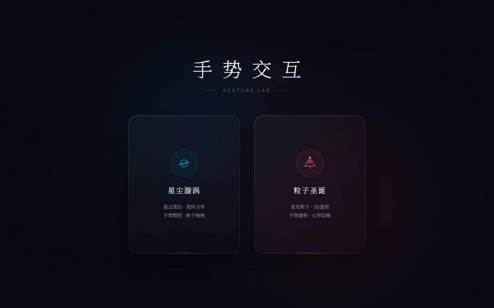

<div align="center">

# 手势交互实验室 · GESTURE LAB

一个基于 MediaPipe Hands 和 Canvas 2D 的纯摄像头手势物理交互实验室。

[在线演示](#) · [开发日志](CHANGELOG.md) · [升级计划](TODO.md)

[](LICENSE)
[](CHANGELOG.md)
[](#)

</div>

---

## ✨ 特性 (Features)

- 🖐️ **纯摄像头手势驱动 (Pure Camera Mode)**：彻底摆脱鼠标/键盘，100% 依赖手势识别作为唯一输入源，带来纯粹的空中阻尼交互感。
- 📱 **多端全设备自适应 (Cross-Platform)**：桌面端/移动端全兼容。移动端自动降级摄像头分辨率（320x240）并启用低耗电模型（`modelComplexity: 0`），并集成静音自动播放音频与竖屏横放提示层。
- ⏳ **极佳交互引导 (Interactive Onboarding)**：新增高颜值毛玻璃加载界面（Glassmorphic Loader），将摄像头权限获取与 AI 神经网络模型下载阶段可视化，提供渐进式步骤指引，彻底解决加载等待焦虑。
- 🎨 **两大魔幻粒子交互模式**：
  - **星尘漩涡 (Stardust Vortex)**：基于流体力学的星体拖拽、吸附与引力模拟。
  - **粒子圣诞 (Christmas Tree)**：支持手势旋转、心形聚拢与礼物喷发的 3D 圣诞树粒子系统。
- ⚡ **极限性能调优 (High Performance)**：
  - **单路径批量绘制 (Single-Path Batching)**：合并 Canvas 绘制路径，单次 `stroke()` 渲染，渲染耗时几乎归零。
  - **平方距离预剪裁 (Fast Squared Distance Pruning)**：避开大批量开方数学运算，CPU 物理耗时减半。
  - **3D 投影与深度缓存**：粒子在物理更新阶段一次性算好 3D 到 2D 投影与深度值并缓存，渲染期零重复数学计算。
  - **非激活状态挂起**：进入子视图后自动挂起主菜单背景渲染，省下 100% 背景清屏渲染功耗。
- 🎶 **动态手势音效与背景音乐**：进入不同场景自适应调配和播放 BGM，核心手势触发时带有 Web Audio API 实时合成的清脆音效反馈。
- 🕸️ **极强网络容错 (Resiliency Fallback)**：CDN 库部分加载失败时，自动降级为手写的 `requestAnimationFrame` 原生视频流捕获循环，确保系统稳定不崩溃。

## 📸 预览 (Preview)

### 3D 效果概念图 (Concept Mockup)


### 真实网页截图 (Real Selector Screenshot)


## 🚀 快速启动 (Quick Start)

### 1. 克隆仓库
```bash
git clone https://github.com/yourname/gesture-lab.git
cd gesture-lab
```

### 2. 启动本地服务器
由于 MediaPipe 运行 WebAssembly 资源存在浏览器跨域安全策略，项目**无法直接通过双击双击 `app.html` 打开**，必须托管在 HTTP 服务下。

#### 方法一：使用内置一键安装脚本（推荐 💡）
项目附带了一个方便的 Python 一键启动和资源下载脚本：
```bash
python3 setup.py
```
**该脚本会自动**：
- 下载 MediaPipe WASM 核心包及模型依赖到本地的 `lib/` 目录中。
- 自动检测本地资源，拉取成功后在 `http://127.0.0.1:8000` 启动简易服务器。
- 在浏览器中访问即可体验。

#### 方法二：使用 Node.js 全局服务
如果您已经有 Node 环境，可以使用全局 `http-server`：
```bash
npm install -g http-server
http-server -p 8000
```
然后在浏览器中打开: `http://localhost:8000/index.html`。

---

## 📂 目录结构 (Project Structure)

```text
gesture-lab/
├── app.html                  # 核心交互主界面 HTML
├── index.html                # 入口文件（引导自动跳转）
├── setup.py                  # Python 一键拉取依赖及本地服务器脚本
├── LICENSE                   # 开源许可证 (MIT)
├── .gitignore                # Git 忽略配置
├── README.md                 # 说明文档
├── CHANGELOG.md              # 历史更新日志
└── TODO.md                   # 迭代及升级路线图
│
├── css/
│   └── app.css               # 全局 UI、毛玻璃选择卡片、横屏提示及响应式布局
│
└── js/
    ├── audio.js              # 音频控制与实时合成手势音效 (Web Audio API)
    ├── gesture.js            # 摄像头流控制、MediaPipe 动态加载与手势分类
    ├── main.js               # 主渲染循环、性能分配调度与视图切换控制
    ├── solar.js              # 星尘漩涡物理状态与行星轨道轨迹逻辑
    ├── solar_draw.js         # 星云大云团与背景星星的高性能绘制
    └── tree.js               # 3D 圣诞树粒子数学旋转、投影缓存与礼物喷发
```

---

## 🛠 技术栈 (Tech Stack)

- **核心计算**：Google MediaPipe Hands API (WebAssembly)
- **图形渲染**：HTML5 Canvas 2D API (纯原生无第三方 WebGL 依赖)
- **排版系统**：CSS3 (Flexbox & Grid 混合排版、Glassmorphism 毛玻璃特效)
- **逻辑驱动**：Vanilla JavaScript (ES6+)
- **本地服务**：Python 3 (urllib & http.server)

---

## 📌 核心手势与操作映射

| 手势识别 | 视觉表现 | 星尘漩涡场景 | 粒子圣诞场景 |
| :--- | :--- | :--- | :--- |
| ✊ **握拳 (gather)** | 万象归一 | 吸引所有尘埃与行星向中心凝聚 | 星尘螺旋粒子加速聚拢 |
| ☝️ **单指 (rotate)** | 漩涡旋转 | 星云与尘埃加速绕轴旋转 | 圣诞树旋转速度增加 |
| ✌️ **双指 (attract)**| 引力吸引 | 引力点随手势位置拖拽并吸引尘埃 | 粒子被指尖缓慢吸引 |
| 🤟 **三指 (heart)**  | 流体涡流 | 引力点激起剧烈的流体漩涡并变形 | 圣诞树粒子渐变组成 3D 红色桃心 |
| 🖐️ **全掌 (stream)** | 流体喷发 | 指尖激起排斥波，尘埃向外喷涌 | 树顶的璀璨流光开始向下喷发礼盒 |

## 📌 路线图 (Roadmap)

我们已规划了以下功能的迭代（完整规划请查看 [TODO.md](TODO.md)）：
- 👐 **双手互动**：支持双手协同触发的复杂手势引擎。
- ⚙️ **自定义手势绑定**：提供按键映射功能，将手势操作绑定到常用的浏览器行为。
- 🗣️ **手势控件自定义 (Natural Language Builder)**：**[未来展望]** 允许用户通过自然语言生成自己想要的手势操控界面和触发事件。
- 🚀 **WebGL 高性能渲染**：向 WebGL 的进一步技术迁移。

## 🤝 贡献 (Contributing)

欢迎提交 PR 与 Issue！若要贡献代码，请查看 [CONTRIBUTING.md](CONTRIBUTING.md) 以了解提交规范。

## 📄 许可证 (License)

本项目基于 [MIT License](LICENSE) 协议开源，详情请参见主目录下的 `LICENSE` 文件。

## 👤 作者 (Author)

GitHub: [@14sword](https://github.com/14sword)

